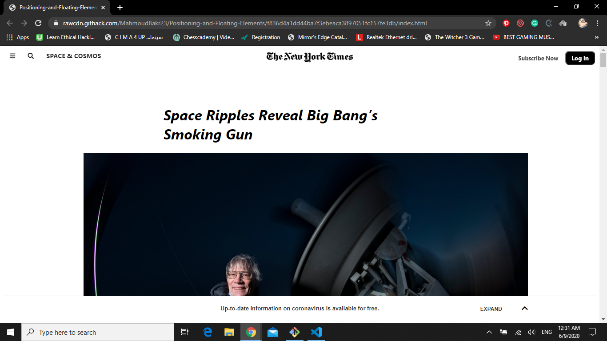
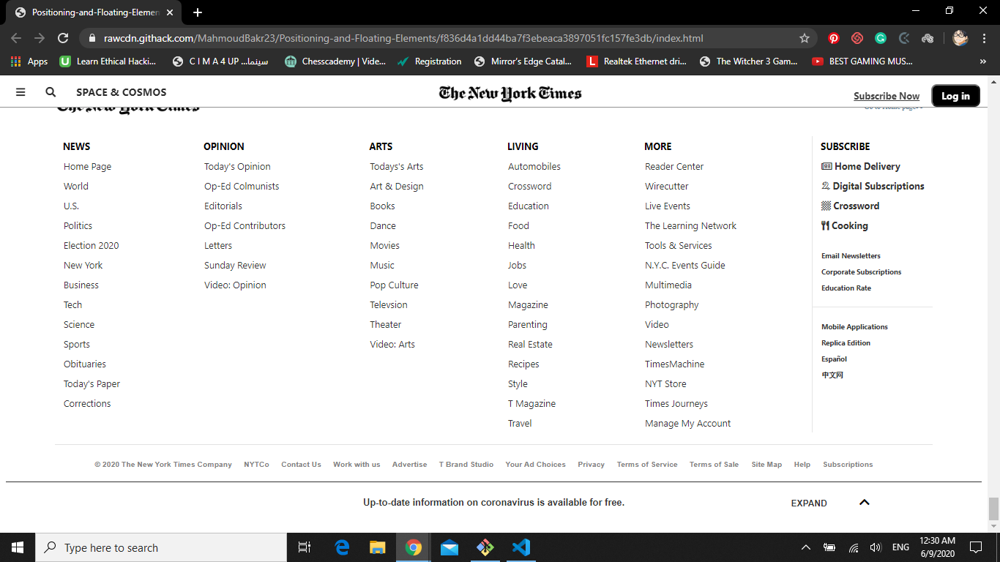

# Positioning-and-Floating-Elements
Positioning and Floating Elements CSS3 project

**This is a webpage which is similar to NYT's questions article page.**

## Built With

- HTML
- CSS3

[Live Demo Link](https://rawcdn.githack.com/MahmoudBakr23/Positioning-and-Floating-Elements/f836d4a1dd44ba7f3ebeaca3897051fc157fe3db/index.html)

## Getting Started

**Clone this Github repository.**

## Authors

👤 **Author1**

- Github: [@MahmoudBakr23](https://github.com/MahmoudBakr23)

👤 **Author2**

- Github: [@OlawaleJoseph](https://github.com/OlawaleJoseph)